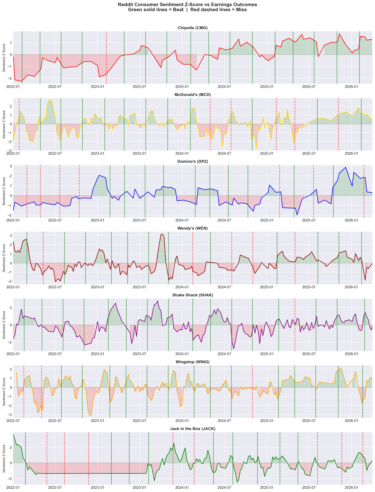
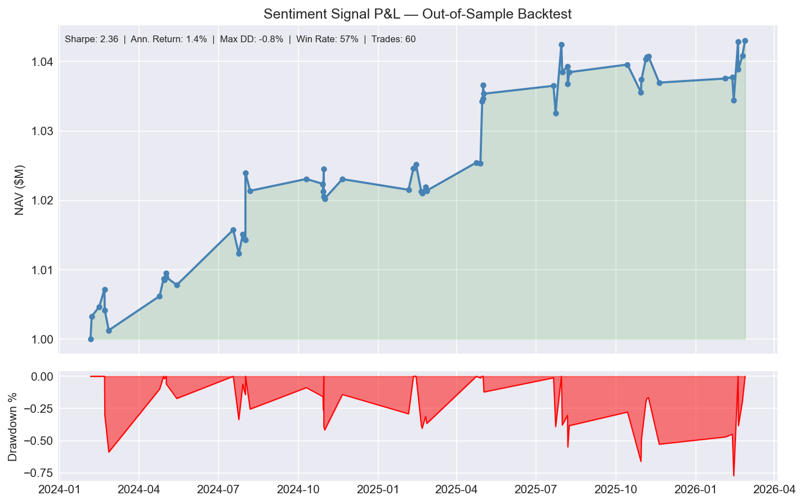
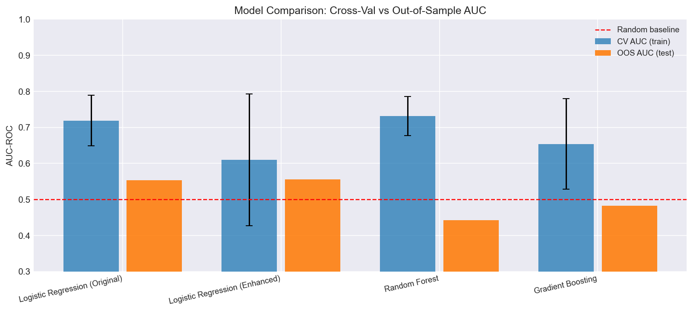

Consumer Sentiment as a Leading Indicator: Reddit NLP Signal for Restaurant Chain Earnings Prediction
An end-to-end alternative data pipeline for monitoring consumer sentiment inflection points in restaurant chain subreddits. Scrapes Reddit posts, scores sentiment using VADER NLP, and tests whether shifts in consumer sentiment precede changes in financial results. The original exploratory notebook is preserved in archive/.

Signal Application
The primary use case is continuous monitoring for sentiment inflection points throughout a holding period. A sustained shift in consumer sentiment may precede changes in reported sales numbers, creating an opportunity to identify thesis changes before they appear in financial results. The earnings backtest measures signal quality — earnings outcomes provide objective ground truth labels — but the signal is relevant throughout the holding period, not just at earnings catalysts. For a quant or event-driven fund, the same signal could form a composite factor tested against forward returns at any point in time — not just around earnings events.

What's New in This Version

Expanded from 5 to 7 tickers (added WING and JACK)
Extended date range through April 2026 (~50 to 119 earnings events)
Added a 7-day pre-earnings window alongside the original 30-day
Returns-based backtest using real price data
Probability and sentiment threshold sweep functions
Temporal train/test split replacing random cross-validation
Random Forest and Gradient Boosting added alongside the original logistic regression
Reorganized from a single notebook into separate modules

Quickstart

git clone https://github.com/alaverne/Consumer-Sentiment-as-a-Leading-Indicator-Reddit-NLP-Signal-for-Restaurant-Chain-Earnings-Prediction
cd Consumer-Sentiment-as-a-Leading-Indicator-Reddit-NLP-Signal-for-Restaurant-Chain-Earnings-Prediction
pip install -r requirements.txt

# Demo mode (synthetic data, no API calls needed):
python main.py

# Live mode (real Reddit scrape + yfinance earnings):
python main.py --mode live

Demo mode runs on synthetic data so you can test the pipeline without scraping anything. Live mode pulls real Reddit posts and earnings data — the scraping takes about 20-30 minutes.

Architecture

scraper.py — pulls posts from the Arctic Shift API
feature_engineering.py — VADER scoring and signal construction
models.py — trains and evaluates all four classifiers
backtest.py — P&L engine with Sharpe, drawdown, and per-ticker stats
visualizations.py — 8 charts
main.py — runs everything end to end
data_generator.py — synthetic data for demo mode
archive/ — original exploratory notebook

Ticker Universe & Selection Rationale
My original analysis covered SBUX, NKE, and CMG. I ended up dropping and replacing NKE and SBUX.
The r/starbucks thread is full of employees talking about working conditions and unionization, rather than customer experience sentiment. The model actually confirmed this, as SBUX had high positive sentiment before misses, which is the opposite of what should happen if the signal worked.
In the r/Nike thread, there were a bunch of posts where people were reselling things or talking about new releases. It wasn't really representative of Nike's broader consumer base. There was also only one earnings miss in the whole span of the data, so I couldn't really train a meaningful classifier with that.
After removing those two companies, I added a few other restaurant chains where the subreddits were more clearly customer-focused (people complaining about portion sizes, wait times, new menu items, etc.), as these are better indicators of sales.
For this version I also added WING and JACK — both single-brand, customer-focused communities where posts skew toward price and portion complaints, similar to the original five.

Key Findings
The backtest using real price data produced 60 trades (53 long, 7 short) over the test period. The selectivity is intentional — the model only takes a position when conviction is high. Win rate was 56.7%, Sharpe ratio 2.36, and maximum drawdown -0.8%. A fund with higher conviction in the signal after more data could size more aggressively.

Methodology
Sentiment Scoring
I used VADER for sentiment scoring after testing FinBERT first. Despite FinBERT being finance-specific, VADER performed better on this dataset — Reddit's informal language aligns better with VADER's social media training.
Signal Construction: Two Pre-Earnings Windows
The original pipeline used a single 30-day window — long enough to capture a trend, short enough to stay relevant to the quarter. The enhanced pipeline adds a 7-day window to measure whether recent sentiment shifts add information beyond the 30-day average. A third feature, sentiment_shift_30_7, captures the difference between the two windows — measuring whether sentiment is accelerating or decelerating heading into the announcement.
Engagement Weighting
Posts are weighted by per-ticker percentile rank rather than raw upvote counts. A post in the top 10% of engagement for r/ShakeShack gets similar weight to a top 10% post on r/McDonalds — regardless of the raw upvote difference between those communities. Using absolute counts would systematically overweight larger communities and underweight smaller ones like WING and JACK.
Normalization
Z-scored by ticker so scores are comparable across brands. r/chipotle has a different baseline tone than r/Wendys — a −1.5 z-score means the same thing for both after normalizing. Min-max scaling was tested first but was too sensitive to outliers. Z-scoring is more stable for detecting deviations from a company's own baseline.
Class Imbalance
The majority of earnings events in the dataset are beats. Without class_weight='balanced', the logistic regression learns to predict beat every time and achieves high accuracy while catching zero misses. Balancing the classes forces the model to actually learn what a miss looks like.
Train / Test Split
The data is split at January 2024 — everything before that trains the models, everything after is held out for testing. That gives 56 training events and 63 test events with 18 misses. I used 3-fold TimeSeriesSplit CV rather than the standard 5-fold because with ~56 training events, 5-fold produced NaN AUC scores — the folds were too small to have enough misses to compute AUC reliably.
Models
Four classifiers were tested alongside the original logistic regression, which uses only pre30_sent as a baseline. The enhanced logistic regression adds the 7-day window and sentiment shift features with stronger regularization. Random Forest and Gradient Boosting test whether non-linear interactions between features add predictive power — with 3 features and ~56 training events there isn't a lot for these models to work with, but the comparison is useful for checking whether a non-linear relationship exists. A Ridge regression predicting EPS surprise magnitude is included as exploratory analysis only.

Results
The pipeline scraped 24,677 posts across 7 tickers, filtered to 19,401 after removing low-signal posts, covering 119 earnings events. The temporal split produced 56 training events and 63 test events with 18 misses in the test set.
In 3-fold cross-validation on the training set, Random Forest achieved the highest mean AUC at 0.731, followed by the original logistic regression at 0.719, Gradient Boosting at 0.654, and the enhanced logistic regression at 0.610. Out-of-sample, the enhanced logistic regression achieved the highest AUC at 0.556 with 63.5% accuracy, the original logistic regression 0.553 and 65.1%, Gradient Boosting 0.482 and 69.8%, and Random Forest 0.442 and 63.5%.
The magnitude regression produced an OOS MAE of 14.795% and R² of −0.299, confirming it is exploratory only. The 30-day window showed a correlation of 0.132 with earnings outcomes (n=114) and the 7-day window 0.110 (n=76).

The returns-based backtest using Gradient Boosting with real price data produced 60 trades (53 long, 7 short), a win rate of 56.7%, annualized return of 1.4%, Sharpe ratio of 2.36, and maximum drawdown of -0.8%.

Limitations
Sample size and the 30+ benchmark:
The current OOS test set has 45 beats and 18 misses. The standard threshold for robust binary classification metrics is 30+ examples of each class, so results should be interpreted as exploratory rather than confirmatory. Expanding the ticker universe is the primary path to closing this gap.
yfinance earnings date accuracy:
Earnings dates sourced from yfinance can occasionally be off by 1–2 days. A one-day error shifts all window boundaries and could accidentally include post-announcement posts in the pre-earnings features — a subtle but material form of look-ahead bias. In production, earnings dates should be cross-referenced against a second source before computing any features.
VADER sentiment limitations:
VADER scores words independently, which means it misses sarcasm and negation modifiers. A context-aware model like fine-tuned RoBERTa would handle these cases better, but VADER outperformed FinBERT on this dataset empirically — likely because the informal language advantage outweighs the context limitation for Reddit text.
Engagement is community-relative throughout:
Both the post filter and engagement weighting use per-ticker relative engagement rather than absolute thresholds. The 75th percentile threshold is a reasonable starting point but was not empirically tuned and could be optimized with more data.
Comment-level sentiment not captured:
Only post titles and body text were scored. Reddit comments often contain more detailed consumer feedback than the post itself and may represent additional signal worth exploring.
EPS surprise magnitude varies significantly by ticker:
The Ridge regression is trained on a pooled dataset across all seven tickers, which is a limitation — a large beat for WEN might be a 3% EPS surprise while a large beat for SHAK might be 20%. It is kept as exploratory analysis only.

Next Steps

Systematically test longer lookback windows (T-45, T-60) to see whether the signal strengthens further from earnings
Extend scoring to Reddit comments, which often contain more detailed feedback than post titles
Test ticker-specific models
Cross-reference yfinance earnings dates against the Nasdaq calendar to eliminate 1-2 day date errors
Combine Reddit sentiment with credit card transaction data as a behavioral validator
Expand the ticker universe to 15-20 names to get closer to the 30+ miss threshold needed for robust classification metrics

Requirements
pandas>=2.0  numpy>=1.24  scikit-learn>=1.3
matplotlib>=3.7  seaborn>=0.12  vaderSentiment>=3.3
yfinance>=0.2  requests>=2.28  lxml>=4.9
